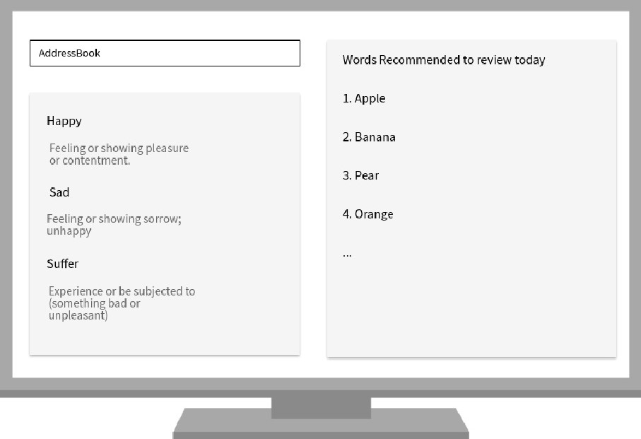

= Address Book (Level 4)
ifdef::env-github,env-browser[:relfileprefix: docs/]

https://travis-ci.org/se-edu/addressbook-level4[image:https://travis-ci.org/se-edu/addressbook-level4.svg?branch=master[Build Status]]
https://ci.appveyor.com/project/damithc/addressbook-level4[image:https://ci.appveyor.com/api/projects/status/3boko2x2vr5cc3w2?svg=true[Build status]]
https://coveralls.io/github/se-edu/addressbook-level4?branch=master[image:https://coveralls.io/repos/github/se-edu/addressbook-level4/badge.svg?branch=master[Coverage Status]]
https://gitter.im/se-edu/Lobby[image:https://badges.gitter.im/se-edu/Lobby.svg[Gitter chat]]

ifdef::env-github[]

endif::[]

ifndef::env-github[]
image::images/Ui.png[width="600"]
endif::[]

* This is a desktop version of Learn Vocabulary. It has a GUI but most of the user interactions happen using a CLI (Command Line Interface).
* It is a Java sample application intended for students learning Software Engineering while using Java as the main programming language.
* It is a application especially designed for those people who have the habit of using CLI and would like to learn more vocabulary.

== Site Map

* <<UserGuide#, User Guide>>
* <<DeveloperGuide#, Developer Guide>>
* <<LearningOutcomes#, Learning Outcomes>>
* <<AboutUs#, About Us>>
* <<ContactUs#, Contact Us>>

== Acknowledgements

* The original source of the code is taken from AddressBook-Level4 project, created by SE-EDU initiative at https://github.com/se-edu/

* Libraries used: https://github.com/TestFX/TestFX[TextFX], https://bitbucket.org/controlsfx/controlsfx/[ControlsFX], https://github.com/FasterXML/jackson[Jackson], https://github.com/google/guava[Guava], https://github.com/junit-team/junit5[JUnit5]

== Licence : link:LICENSE[MIT]
