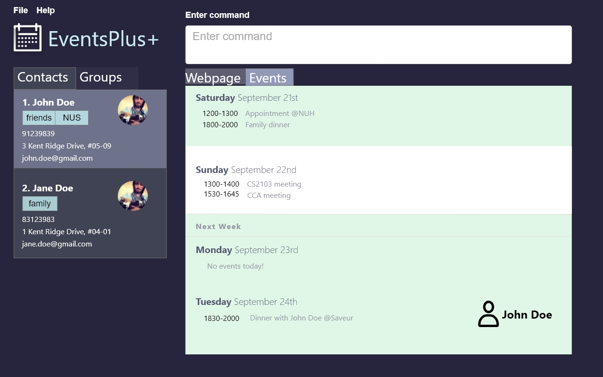

= EventsPlus+
ifdef::env-github,env-browser[:relfileprefix: docs/]

https://travis-ci.org/CS2103-AY1819S1-W13-2/main[image:https://travis-ci.org/CS2103-AY1819S1-W13-2/main.svg?branch=master[Build Status]]
https://ci.appveyor.com/project/kaitingpeck/main[image:https://ci.appveyor.com/api/projects/status/5mecq596nyw31vnu?svg=true[Build status]]
https://coveralls.io/github/CS2103-AY1819S1-W13-2/main?branch=master[image:https://coveralls.io/repos/github/CS2103-AY1819S1-W13-2/main/badge.svg?branch=master[Coverage Status]]
https://gitter.im/se-edu/Lobby[image:https://badges.gitter.im/se-edu/Lobby.svg[Gitter chat]]

ifdef::env-github[]

endif::[]

ifndef::env-github[]
image::images/EventsUI.jpg[width="600"]
endif::[]

""
A [blue]*convenient* and [green]*time-saving* command-line interface event manager for university students. With this
one-stop shop
for managing contacts and events, a few lines and you’re all set!
""

* This is a desktop Address Book application. It has a GUI but most of the user interactions happen using a CLI (Command Line Interface).
* It is a Java application catered for busy university students to manage their contacts, events and project meetings
 efficiently.
* This application includes the following features:
** A sophisticated GUI that includes a list panel and an in-built Browser.
** Support for _Build Automation_ using Gradle and for _Continuous Integration_ using Travis CI.

* With this application, you can
** Manage groups of contacts easily
** Work in multiple groups conveniently and contact multiple persons with one command via a third-party application.
** Obtain suggested locations and timings for events or meetings based on participants’ locations and timetable.
** Send automated RSVP requests, for event or meeting participants using the app.

== Site Map

* <<UserGuide#, User Guide>>
* <<DeveloperGuide#, Developer Guide>>
* <<AboutUs#, About Us>>
* <<ContactUs#, Contact Us>>

== Acknowledgements

* Some parts of this sample application were inspired by the excellent http://code.makery.ch/library/javafx-8-tutorial/[Java FX tutorial] by
_Marco Jakob_.
* Libraries used: https://github.com/TestFX/TestFX[TextFX], https://bitbucket.org/controlsfx/controlsfx/[ControlsFX], https://github.com/FasterXML/jackson[Jackson], https://github.com/google/guava[Guava], https://github.com/junit-team/junit5[JUnit5]

== Licence : link:LICENSE[MIT]
