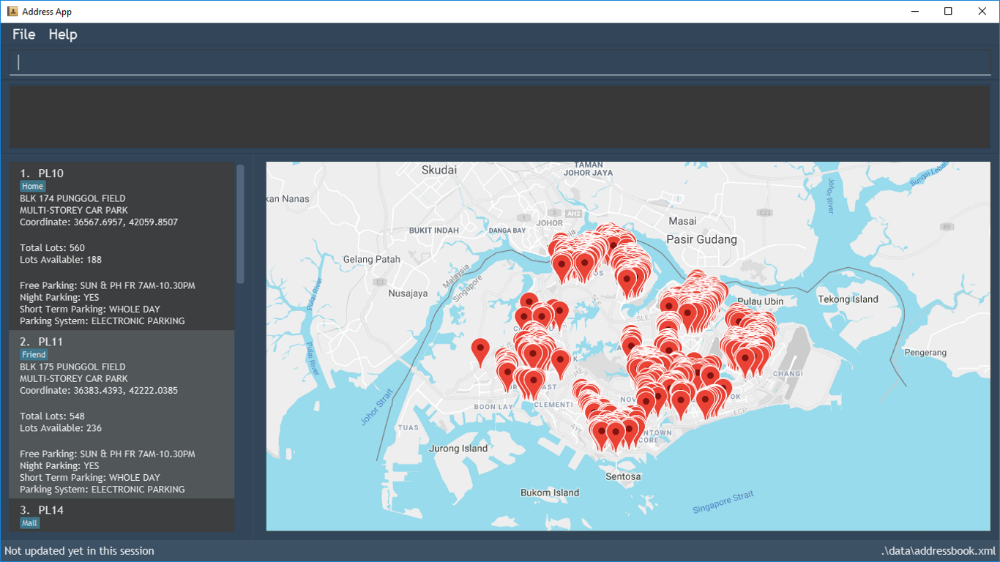

= Expense Tracker
ifdef::env-github,env-browser[:relfileprefix: docs/]

image:https://travis-ci.org/CS2103-AY1819S1-T12-1/main.svg?branch=develop["Build Status", link="https://travis-ci.org/CS2103-AY1819S1-T12-1/main"]
//https://ci.appveyor.com/project/JasonChong96/main[image:https://ci.appveyor.com/api/projects/status/jae5ywvu7fdjst00?svg=true[Build status]]
https://coveralls.io/github/CS2103-AY1819S1-T12-1/main?branch=develop[image:https://coveralls.io/repos/github/CS2103-AY1819S1-T12-1/main/badge.svg?branch=develop[Coverage Status]]
image:https://api.codacy.com/project/badge/Grade/56707ee7344441ebaa5839b92e17a881["Codacy code quality", link="https://www.codacy.com/app/JasonChong96/main?utm_source=github.com&utm_medium=referral&utm_content=CS2103-AY1819S1-T12-1/main&utm_campaign=Badge_Grade"]
https://gitter.im/se-edu/Lobby[image:https://badges.gitter.im/se-edu/Lobby.svg[Gitter chat]]

ifdef::env-github[]

image::docs/images/Ui.png[width="600"]

endif::[]

Have you ever lost track of your expenditure and burst your budget for the month? Fret not! Expense Tracker is
here to help you. With features which help you manage, organise and analyse your expenses, staying within your budget
has never been easier. +

Interested? Head over to the <<UserGuide#, User Guide>> to get started!

Expense Tracker is an open source project that welcomes contributions from the community. If you are interested in
contributing to this project, head over to the <<DeveloperGuide#, Developer Guide>> to get started!

== Site Map

* <<UserGuide#, User Guide>>
* <<DeveloperGuide#, Developer Guide>>
* <<AboutUs#, About Us>>
* <<ContactUs#, Contact Us>>

== Acknowledgements

* This application was inspired by the AddressBook-Level4 project created by SE-EDU initiative at https://github.com/se-edu/
* Libraries used: https://github.com/TestFX/TestFX[TextFX], https://bitbucket.org/controlsfx/controlsfx/[ControlsFX], https://github.com/FasterXML/jackson[Jackson], https://github.com/google/guava[Guava], https://github.com/junit-team/junit5[JUnit5]

== Licence : link:LICENSE[MIT]
