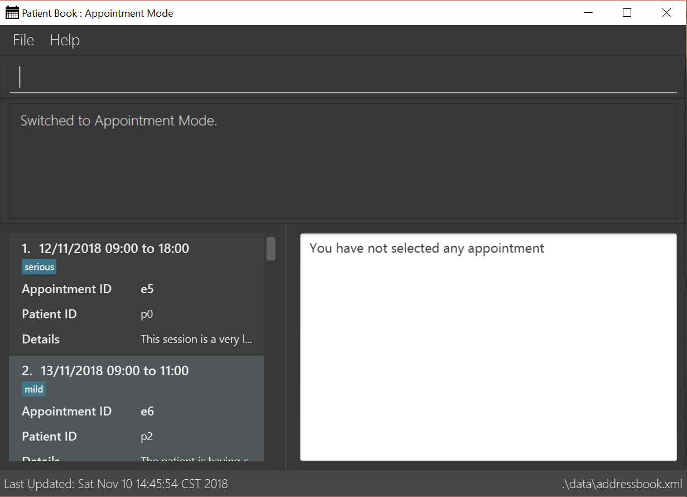

= Patient Book
ifdef::env-github,env-browser[:relfileprefix: docs/]

image:https://travis-ci.org/CS2103-AY1819S1-T12-2/main.svg?branch=master["Build Status", link="https://travis-ci.org/CS2103-AY1819S1-T12-2/main"]
https://coveralls.io/github/CS2103-AY1819S1-T12-2/main?branch=master[image:https://coveralls.io/repos/github/CS2103-AY1819S1-T12-2/main/badge.svg?branch=master[Coverage Status]]
image:https://api.codacy.com/project/badge/Grade/c387f0eda1874a4bab5b255ef53eb2c0[link="https://app.codacy.com/app/lixinze777/main?utm_source=github.com&utm_medium=referral&utm_content=CS2103-AY1819S1-T12-2/main&utm_campaign=Badge_Grade_Dashboard"]
https://gitter.im/se-edu/Lobby[image:https://badges.gitter.im/se-edu/Lobby.svg[Gitter chat]]

ifdef::env-github[]
image::docs/images/Ui.png[width="600"]
endif::[]

ifndef::env-github[]
image::images/Ui.png[width="600"]
endif::[]

ifdef::env-github[]

endif::[]

ifndef::env-github[]
image::images/mode_appointment.PNG[width="600"]
endif::[]

* This is a desktop Patient Book application. It has a GUI but most of the user interactions happen using a `CLI`
(Command Line Interface).
* It is a Java application intended for doctors to arrange information of their `patients` and `appointments`.
It also aids doctors making diagnosis by providing information on `symptoms`, `diseases` and `drugs`.
* It is *written in OOP fashion*.

== Site Map

* <<UserGuide#, User Guide>>
* <<DeveloperGuide#, Developer Guide>>
* <<AboutUs#, About Us>>
* <<ContactUs#, Contact Us>>

== Acknowledgements

* Some parts of this sample application were inspired by the excellent http://code.makery.ch/library/javafx-8-tutorial/[Java FX tutorial] by
_Marco Jakob_.
* Libraries used: https://github.com/TestFX/TestFX[TextFX], https://bitbucket.org/controlsfx/controlsfx/[ControlsFX], https://github.com/FasterXML/jackson[Jackson], https://github.com/google/guava[Guava], https://github.com/junit-team/junit5[JUnit5]
* Original source code was adopted from https://github.com/se-edu/ (addressbook-level4)

== Licence : link:LICENSE[MIT]
