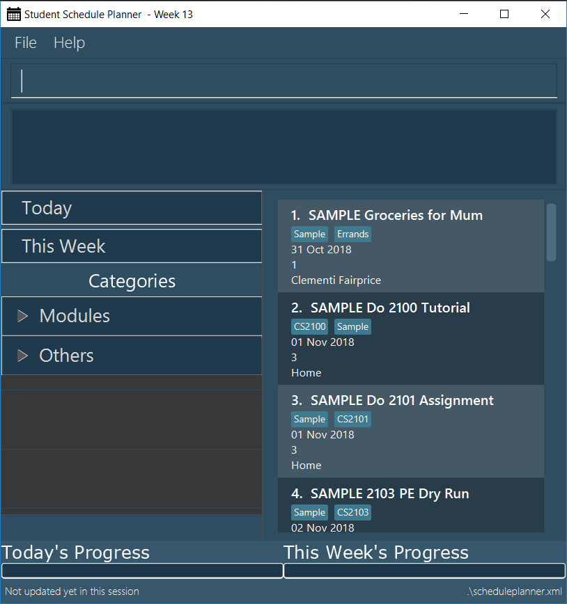

= Picconso: The Console-based Image Editor

ifdef::env-github,env-browser[:relfileprefix: docs/]

Picconso is an CLI (Command Line Interface) Image Editor designed and developed for quick and efficient image-editing. Many image-editors are complex and difficult to pick up, having a steep learning curve and sometimes even a steep price! +

Unlike them, Picconso offers the same features, in a much more simplified manner. With Picconso, all traditional image-editing features can be performed solely through text commands, removing the hassle of working with a mouse. The interface can be used by
photographers, designers, developers and more, and is very easy to pick up.

== Product

ifdef::env-github[]

endif::[]

ifndef::env-github[]
image::images/Ui.png[width="602"]
endif::[]

Above shows the predicted UI layout

* Shows original image and rendered preview
* Current working set shows images that are currently being edited
* Transformation history shows list of transformations applied on image
* Command console and cin for input of commands.

== Features

* Several traditional image-editing features such as crop, blur, sharpen, etc.
* Mass editing several images at once
* Direct access to images on Google Photos (download and upload)
* Capability to define own custom transformation set.
* A wide range of edit text-commands that remove the need for a mouse.

== Site Map

* <<UserGuide#, User Guide>>
* <<DeveloperGuide#, Developer Guide>>
* <<AboutUs#, About Us>>

== Acknowledgements

* This application is morphed from the https://github.com/se-edu/[AddressBook-Level4] project created by _SE-EDU_ initiative for student learning.
