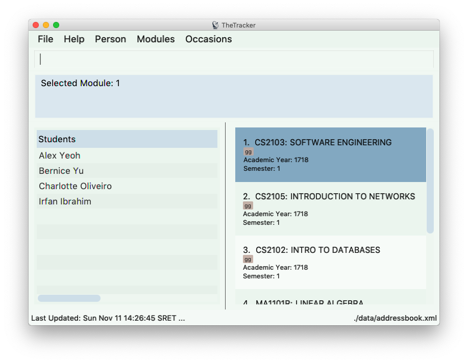
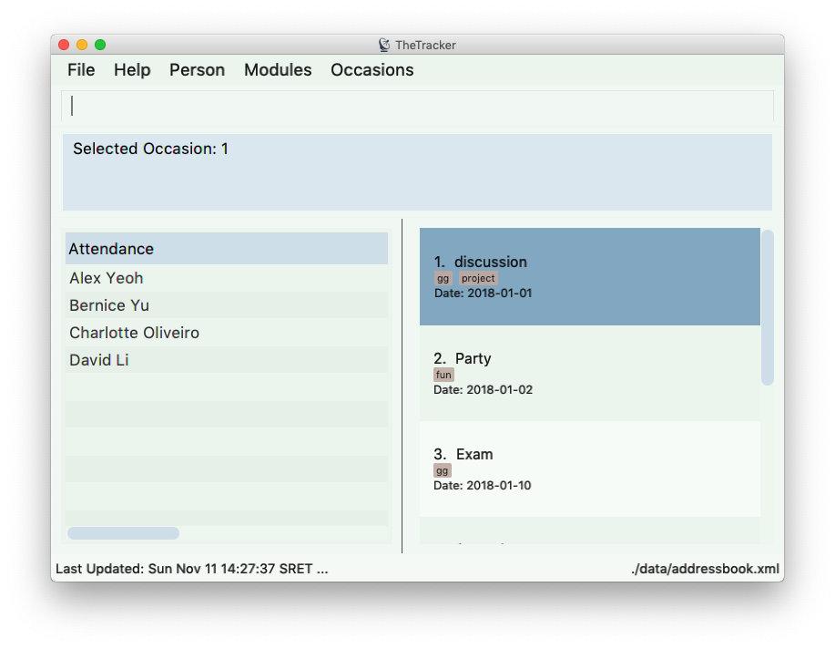

= TheTracker
ifdef::env-github,env-browser[:relfileprefix: docs/]

https://travis-ci.org/CS2103-AY1819S1-W10-1/main[image:https://travis-ci.org/CS2103-AY1819S1-W10-1/main.svg?branch=master[Build Status]]
https://coveralls.io/github/CS2103-AY1819S1-W10-1/main?branch=master[image:https://coveralls.io/repos/github/CS2103-AY1819S1-W10-1/main/badge.svg?branch=master[Coverage Status]]

image::docs/images/Ui1.png[width="600"]

* Welcome to TheTracker
* TheTracker aims to help NUS students keep track of their friends, modules and events.
* Students can find other students who share their major, have common modules,
while also noting those in charge of key events.
* The design of TheTracker favours students who prefer interactions which are
 using CLI(Command Line Interface). Experienced users can do multiple updates at once,
 but new users can perform these step by step.
* TheTracker welcomes students who:
** Are sociable and wish to stay in contact with his/her NUS peers
** Want a multi-utility academic tool, to record grades, modules and peers
** Are looking for a minimalistic scheduler/planner

== Site Map

* <<UserGuide#, User Guide>>
* <<DeveloperGuide#, Developer Guide>>
* <<AboutUs#, About Us>>
* <<ContactUs#, Contact Us>>

== Acknowledgements

* The original source of code: AddressBook-Level4 project created by SE-EDU
initiative at https://github.com/se-edu/g
* Libraries used: https://github.com/TestFX/TestFX[TextFX], https://bitbucket.org/controlsfx/controlsfx/[ControlsFX], https://github.com/FasterXML/jackson[Jackson], https://github.com/google/guava[Guava], https://github.com/junit-team/junit5[JUnit5]

== Licence : link:LICENSE[MIT]
