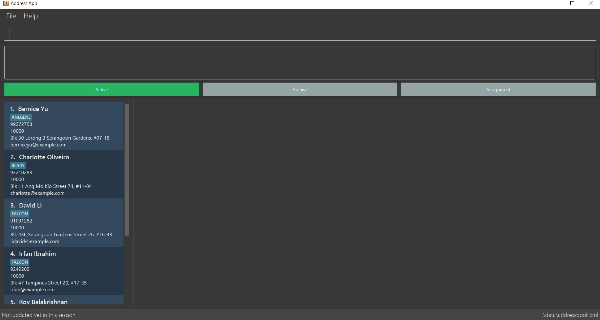

= Office Assistance Specialized Integrated System (OASIS)
ifdef::env-github,env-browser[:relfileprefix: docs/]

image:https://travis-ci.org/CS2103-AY1819S1-F10-1/main.svg?branch=master["Build Status", link="https://travis-ci.org/CS2103-AY1819S1-F10-1/main"]
image:https://ci.appveyor.com/api/projects/status/sbbu13iahl2smpox/branch/master?svg=true["Build Status", link="https://ci.appveyor.com/project/bugfreeSpice/main/branch/master"]
image:https://coveralls.io/repos/github/CS2103-AY1819S1-F10-1/main/badge.svg?branch=master["Coverage Status", link="https://coveralls.io/github/CS2103-AY1819S1-F10-1/main?branch=master"]
////
https://www.codacy.com/app/damith/addressbook-level4?utm_source=github.com&utm_medium=referral&utm_content=se-edu/addressbook-level4&utm_campaign=Badge_Grade[image:https://api.codacy.com/project/badge/Grade/fc0b7775cf7f4fdeaf08776f3d8e364a[Codacy Badge]]
https://gitter.im/se-edu/Lobby[image:https://badges.gitter.im/se-edu/Lobby.svg[Gitter chat]]
////

ifdef::env-github[]
image::docs/images/Ui.png[width="600"]
endif::[]

ifndef::env-github[]
image::images/Ui.png[width="600"]
endif::[]

* This is a desktop employee management application. It has a GUI but most of the user interactions happen using a CLI (Command Line Interface).
* This application is still a WIP. Updates and new releases will occur every fortnight
* Features:
** A more sophisticated GUI that includes a list  panel and an in-built Browser.
** More test cases, including automated GUI testing.
** Support for _Build Automation_ using Gradle and for _Continuous Integration_ using Travis CI.

== Site Map

* <<UserGuide#, User Guide>>
* <<DeveloperGuide#, Developer Guide>>
* <<AboutUs#, About Us>>
* <<ContactUs#, Contact Us>>

== Acknowledgements

* Original source code from https://github.com/se-edu/addressbook-level4/[AddressBook-Level4] project created by https://github.com/se-edu/[SE-EDU] initiative.
* Some parts of this sample application were inspired by the excellent http://code.makery.ch/library/javafx-8-tutorial/[Java FX tutorial] by
_Marco Jakob_.
* Libraries used: https://github.com/TestFX/TestFX[TextFX], https://bitbucket.org/controlsfx/controlsfx/[ControlsFX], https://github.com/FasterXML/jackson[Jackson], https://github.com/google/guava[Guava], https://github.com/junit-team/junit5[JUnit5]

== Licence : link:LICENSE[MIT]
